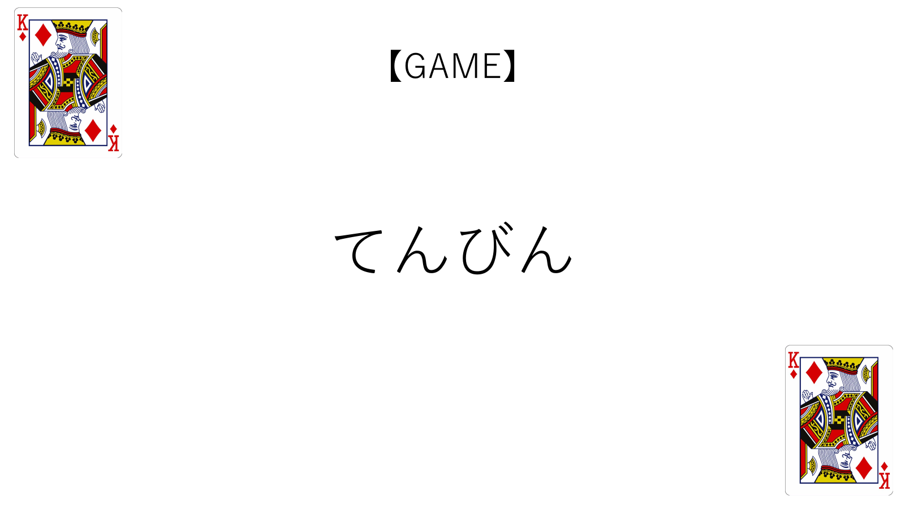

# てんびん (Tenbin) 🎮

**心理戦の極限へ - 数字で繰り広げる駆け引きゲーム**  
**The Ultimate Psychological Battle - A Strategic Number Game**

[](https://your-username.github.io/tenbin-game/)
[](LICENSE)
[](https://reactjs.org/)

> 🎯 **プレイする / Play Now**: https://your-username.github.io/tenbin-game/

---

<div align="center">
  
</div>

---

## 📢 更新情報 / Updates

### v1.0.0 - 2025/10/07

#### ✨ 新機能 / New Features
- 🎮 ゲーム初回リリース / Initial game release

<!-- #### 🐛 バグ修正 / Bug Fixes
- 

#### 🔧 改善 / Improvements
-  -->

## 📖 ゲーム概要 / Game Overview

「てんびん」は、プレイヤー同士の心理戦を楽しむ数字選択ゲームです。全員が選んだ数字の平均値×0.8に最も近い値を選んだ人が勝者となります。相手の思考を読み、裏をかき、最後の一人になるまで生き残りましょう！

"Tenbin" is a psychological strategy game where players compete by selecting numbers. The winner is the player whose number is closest to 0.8 times the average of all chosen numbers. Read your opponents' minds, outsmart them, and be the last one standing!

### 🎬 ゲームの特徴 / Key Features

- **🧠 心理戦 / Psychological Warfare**  
  他のプレイヤーの選択を予測し、戦略的に数字を選択  
  Predict other players' choices and select numbers strategically

- **📈 段階的ルール追加 / Progressive Rule System**  
  プレイヤーが脱落するたびに新ルールが追加され、ゲームがより複雑に  
  New rules are added as players are eliminated, making the game increasingly complex

- **🤖 CPU対戦 / CPU Battle**  
  1～5人でプレイ可能。足りない人数はCPUが自動補完  
  Play with 1-5 players. CPU automatically fills remaining slots

- **📱 スマホ横画面対応 / Mobile Landscape Optimized**  
  スマートフォンを回しながら複数人でプレイできる設計  
  Designed for multiplayer gameplay by passing a smartphone around

---

## 🎯 ルール / Rules

### 基本ルール / Basic Rules

1. **数字選択 / Number Selection**  
   制限時間3分の間に0～100の中から数字を1つ選ぶ  
   Select one number from 0 to 100 within 3 minutes

2. **勝利条件 / Victory Condition**  
   全員が選んだ数字の平均値×0.8に最も近い値を選んだ人が勝者  
   The winner is the player closest to 0.8 times the average of all numbers

3. **減点システム / Penalty System**  
   勝者以外の4人が1ポイント減点  
   All players except the winner lose 1 point

4. **脱落条件 / Elimination**  
   減点が-10ポイントに達するとゲームオーバー  
   Players are eliminated when their score reaches -10 points

5. **ゲームクリア / Game Clear**  
   最後に生き残った1人が勝利  
   The last player standing wins the game

### 追加ルール（脱落者発生時に追加） / Additional Rules (Added When Players Are Eliminated)

| 脱落者数<br>Eliminated | 追加ルール<br>Additional Rule |
|---------|----------|
| **1名脱落**<br>1 Player | 2人以上、同数が出た場合、無効票となり1ポイント減点<br>If 2+ players choose the same number, it becomes invalid and they lose 1 point |
| **2名脱落**<br>2 Players | 正解の数字をピタリとあてられたら、敗者は2ポイント減点<br>If someone guesses the exact target number, losers lose 2 points instead of 1 |
| **3名脱落**<br>3 Players | 0を選択した人がいる場合に限り、100を選択した人が勝者<br>If anyone chooses 0, then whoever chooses 100 becomes the winner |

---

## 🎮 遊び方 / How to Play

1. **人数選択 / Select Players**  
   タイトル画面で1～5人のプレイヤー人数を選択  
   Choose the number of players (1-5) on the title screen

2. **プレイヤー設定 / Player Setup**  
   各プレイヤーの名前とアイコンを選択  
   Set names and icons for each player

3. **数字選択 / Choose Numbers**  
   0～100の中から戦略的に数字を選択  
   Strategically select a number from 0 to 100

4. **結果確認 / View Results**  
   勝者と各プレイヤーのスコア変動を確認  
   Check the winner and score changes for all players

5. **生き残り / Survive**  
   -10ポイントに達しないよう、最後の一人になるまで勝負！  
   Avoid reaching -10 points and be the last survivor!

### 💡 戦略のヒント / Strategy Tips

- **初戦 / Early Game**  
  平均は40～50付近になりやすい → 目標値は32～40  
  Average tends to be around 40-50 → Target is around 32-40

- **中盤 / Mid Game**  
  プレイヤーが慣れてくると平均が下がる傾向  
  As players adapt, the average tends to decrease

- **終盤 / Late Game**  
  残り人数が少ないと読み合いが激化  
  Mind games intensify with fewer players remaining

- **追加ルール / Additional Rules**  
  脱落者が出ると戦略が大きく変わる  
  Strategy changes dramatically when new rules are added

---

## 🎨 デザイン / Design

- **カラーパレット / Color Palette**  
  ダークブルー基調のサイバーパンク風デザイン  
  Dark blue cyberpunk-inspired design

- **レスポンシブ / Responsive**  
  スマートフォン横画面に最適化  
  Optimized for smartphone landscape mode

- **アニメーション / Animation**  
  Tailwind CSSのアニメーションユーティリティを活用  
  Utilizing Tailwind CSS animation utilities

- **グリッド背景 / Grid Background**  
  映画のような雰囲気を演出  
  Cinematic atmosphere with grid background

---

## 🤖 CPU思考ロジック / CPU Logic

CPUは以下のロジックで数字を選択します：  
The CPU selects numbers using the following logic:

- **初期（1～2回戦） / Early Rounds (1-2)**  
  40～50付近を選択  
  Selects numbers around 40-50

- **中盤（3～5回戦） / Mid Rounds (3-5)**  
  30～40付近を選択  
  Selects numbers around 30-40

- **終盤（6回戦以降） / Late Rounds (6+)**  
  残りプレイヤー数に応じて戦略的に選択  
  Strategically selects based on remaining player count

- **ルール1対策 / Rule 1 Countermeasure**  
  既に選ばれた数字を避ける  
  Avoids numbers already chosen by others

---

## 🛠️ セットアップ / Setup

### 必要要件 / Requirements

- Node.js 16.x 以上 / or higher
- npm または / or yarn

### インストール / Installation

```bash
# リポジトリをクローン / Clone repository
git clone https://github.com/your-username/tenbin-game.git
cd tenbin-game

# 依存関係をインストール / Install dependencies
npm install
```

### 開発サーバー起動 / Start Development Server

```bash
npm run dev
```

ブラウザで `http://localhost:3000` を開いてください。  
Open `http://localhost:3000` in your browser.

### ビルド / Build

```bash
npm run build
```

ビルドされたファイルは `dist/` ディレクトリに出力されます。  
Built files will be output to the `dist/` directory.

### プレビュー / Preview

```bash
npm run preview
```

---

## 🚀 使用技術 / Tech Stack

### フロントエンド / Frontend

- **React 18.2.0** - UIライブラリ / UI Library
- **Vite 4.3.9** - 高速ビルドツール / Fast Build Tool
- **Tailwind CSS 3.3.2** - ユーティリティファーストCSSフレームワーク / Utility-First CSS Framework
- **Lucide React** - アイコンライブラリ / Icon Library

### 開発ツール / Development Tools

- **PostCSS** - CSS処理 / CSS Processing
- **Autoprefixer** - ベンダープレフィックス自動付与 / Vendor Prefix Automation

### デプロイ / Deployment

- **GitHub Pages** - 静的サイトホスティング / Static Site Hosting

---

## 📂 プロジェクト構成 / Project Structure

```
tenbin-game/
├── src/
│   ├── assets/              # 画像ファイル / Image files
│   │   ├── icon1.png       # プレイヤー1アイコン / Player 1 icon
│   │   ├── icon2.png       # プレイヤー2アイコン / Player 2 icon
│   │   ├── icon3.png       # プレイヤー3アイコン / Player 3 icon
│   │   ├── icon4.png       # プレイヤー4アイコン / Player 4 icon
│   │   └── player-icon.png # CPUアイコン / CPU icon
│   ├── components/          # Reactコンポーネント / React components
│   │   ├── TitleScreen.jsx      # タイトル画面 / Title screen
│   │   ├── RuleScreen.jsx       # ルール説明画面 / Rule screen
│   │   ├── PlayerSelect.jsx     # プレイヤー設定画面 / Player setup
│   │   ├── NumberSelectScreen.jsx # 数字選択画面 / Number selection
│   │   ├── ResultScreen.jsx     # 結果表示画面 / Result screen
│   │   └── ScoreScreen.jsx      # スコア画面 / Score screen
│   ├── utils/               # ユーティリティ関数 / Utility functions
│   │   └── gameLogic.js    # ゲームロジック / Game logic
│   ├── App.jsx             # メインアプリケーション / Main app
│   ├── main.jsx            # エントリーポイント / Entry point
│   └── index.css           # グローバルスタイル / Global styles
├── docs/
│   └── images/             # README用画像 / README images
│       └── game-overview.png
├── public/                  # 静的ファイル / Static files
├── index.html              # HTMLテンプレート / HTML template
├── package.json            # 依存関係管理 / Dependencies
├── vite.config.js          # Vite設定 / Vite config
├── tailwind.config.js      # Tailwind設定 / Tailwind config
└── postcss.config.js       # PostCSS設定 / PostCSS config
```

---

## 📝 ライセンス / License

このプロジェクトは[MITライセンス](LICENSE)の下で公開されています。  
This project is licensed under the [MIT License](LICENSE).

## 🙏 謝辞 / Acknowledgments

This project was inspired by the games featured in 今際の国のアリス (Alice in Borderland). I would like to express my sincere gratitude to the original creator, Haro Aso, for his outstanding work.
